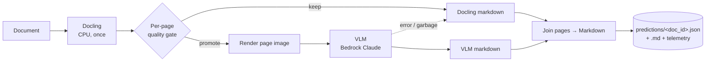
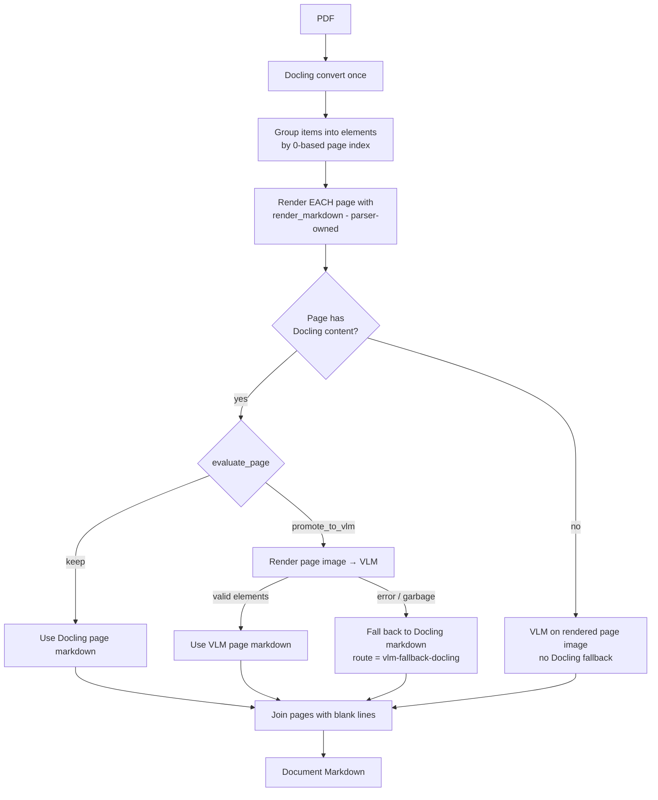
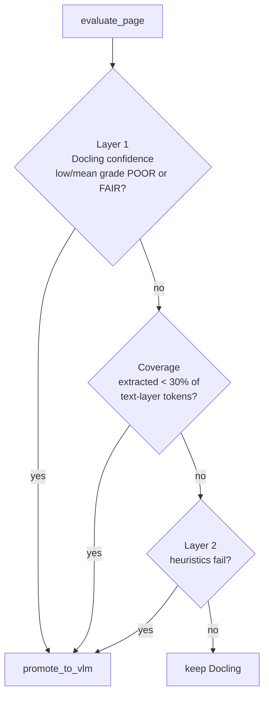

# doc-parser — Architecture & Approach

> **Audience:** engineers and reviewers who need to understand how `doc-parser`
> turns documents into RAG-ready Markdown, how to run it, how it is configured,
> and where it can be improved.
> **Status:** living document · **Branch of record:** `markdown` ·
> **Last updated:** 2026-06-04
>
> *Diagrams use [Mermaid](https://mermaid.js.org/). On Confluence Cloud, paste
> the fenced `mermaid` blocks into a **Mermaid** macro (or enable Markdown +
> Mermaid) — an ASCII fallback is provided for the main pipeline.*

**Contents:**
[TL;DR](#1-tldr) · [Design goals](#2-design-goals) · [Pipeline](#3-pipeline-in-detail) ·
[Components](#4-component-reference) · [Output contract](#5-output-contract) ·
[Configuration](#6-configuration-environment-variables) · [Commands](#7-commands--arguments) ·
[Performance](#8-current-performance-snapshot) · [Limitations](#9-known-limitations--room-for-improvement) ·
[Glossary](#10-glossary)

---

## 1. TL;DR

`doc-parser` (the `parser_service` package) is a **hybrid document parser**: it
runs **Docling on CPU once per document**, then uses a **per-page quality gate**
to decide, page by page, whether Docling's text is good enough to keep or should
be **re-extracted by a vision-language model (VLM)** — AWS Bedrock Claude 3.5
Sonnet. The output is a single clean **Markdown** string per document plus
**per-page routing telemetry** (which route produced each page, and why — see
[§5](#5-output-contract)).

The guiding principle: **Docling is cheap and usually good; the VLM is expensive
and only earns its keep on pages Docling handles poorly.** Spend VLM tokens only
where a gate says they are needed.



New to the project? Read §2–§3 for the design, then jump to
[§7](#7-commands--arguments) to run it.

---

## 2. Design goals

| Goal | How it shows up in the code |
|---|---|
| **Cost-aware quality** | VLM is called *only* on pages a gate flags; most pages stay on Docling. |
| **Never crash a batch** | `parse_to_markdown` and `parse()` follow a **never-raises** contract — every failure becomes a `warnings[]` entry + a route, never an exception. |
| **Deterministic & secret-free grading** | Parsing is separated from grading; predictions are graded offline by the `doc-bench` wheel (file-based, CPU-only, no API keys). |
| **Bounded resource use** | Hard guards on input size, rasterized megapixels, image decompression, and page count (see [§6](#6-configuration-environment-variables)). |
| **Provenance** | Every page records which route produced it (`docling-kept` / `vlm` / `vlm-fallback-docling`) and *why*. |

---

## 3. Pipeline in detail

### 3.1 Format classification

`_classify(path, mime)` maps each input to one of six kinds by extension
(falling back to MIME):

| Kind | Extensions | Path |
|---|---|---|
| `pdf` | `.pdf` | **Per-page gated pipeline** (the core path, §3.2) |
| `image` | `.png .jpg .jpeg .tif .tiff .webp` | **Gated one-page path** (Docling-first, *not* always-VLM) |
| `docx` | `.docx` | Whole-doc `export_to_markdown()`, gate skipped |
| `xlsx` | `.xlsx .xlsm` | Whole-doc `export_to_markdown()`, gate skipped |
| `html` | `.html .htm` | Whole-doc `export_to_markdown()`, gate skipped |
| `unknown` | anything else | Empty markdown + `unsupported_type` warning |

> **Why Office/HTML skip the gate:** flowing formats have no reliable page
> geometry, so there is no per-page element grouping to drive the renderer.
> Docling reads these structurally and its whole-doc export is kept verbatim.

### 3.2 PDF per-page gated pipeline ("Route B")

This is the heart of the system. Adopted 2026-05-31 after benchmark evidence
(see `planning/spike-route-decision.md`).



ASCII fallback (same flow):

```
PDF ─► Docling (once) ─► group items by page ─► render each page (render_markdown)
                                                        │
                            ┌───────────────────────────┴───────────────┐
                            ▼                                            ▼
                  page has no content?                          evaluate_page(page)
                       │ yes                                   │ keep        │ promote
                       ▼                                       ▼             ▼
                 VLM (no fallback)                       Docling md     render image → VLM
                                                                              │
                                                              valid? ── yes ─► VLM md
                                                                  └── no ───► Docling md (vlm-fallback-docling)
                            └──────────────► join pages (\n\n) ◄──────────────┘
```

Two deliberate choices worth knowing:

1. **The renderer is parser-owned, not Docling's.** Each page's Docling elements
   are rendered to Markdown by `markdown.render_markdown`, which scores **~0.05
   NID higher** than Docling's native `export_to_markdown` dialect against the
   verbatim-text gold (measured on both DP-Bench and OmniDocBench). It is
   load-bearing and must not be changed casually.
2. **No slice-shift hazard.** There is no whole-doc export + page-break split. A
   page with no Docling items goes straight to the VLM with *no* fallback, so
   per-page alignment is exact by construction.

### 3.3 The quality gate

`quality_gate.evaluate_page(...)` runs three checks in order and **short-circuits
on the first promotion**:



| Check | Fires when | Rationale |
|---|---|---|
| **Layer 1 — Docling confidence** | `low_grade` or `mean_grade` ∈ {poor, fair} | Free signal Docling already computed during parse. |
| **Coverage** | text layer ≥ 30 tokens **and** extracted < 30% of them | Catches *silent under-extraction* — Docling grades what it read, not what it missed (e.g. tables of contents). |
| **Layer 2 — text heuristics** | any signal below fails | Catches confidently-wrong OCR that grades well. |

**Layer 2 signals** (evaluated on the combined page text):

| Signal | Threshold | Catches |
|---|---|---|
| `garbled_token_ratio` | > 0.20 | letter/digit mixes like `1ooo`, `Rece1ved` |
| `mean_word_length` | < 2.0 | noise / fragmentation |
| `dict_hit_rate` | < 0.50 | non-content tokens (number-dense pages are *allowed*) |
| `repeated_char_run` | run > 6 | `aaaaaaa` OCR artifacts |
| `ascii_printable_ratio` | < 0.90 | binary/control-char garble |

> **Number-dense pages are not garble.** `_is_content_token` counts cleanly
> formatted numbers (currency, %, dates, ranges) as content, so charts and
> financial tables don't get falsely escalated — on verbatim-OCR benchmarks
> Docling actually beats the VLM there.

### 3.4 VLM call & fallback semantics

- **Transport:** `bedrock-runtime.invoke_model`, model `BEDROCK_VLM_MODEL`,
  `temperature=0.0`, `max_tokens=8192`, image sent as base64 (media type sniffed
  from magic bytes). The page prompt (`PAGE_PROMPT`) asks for ordered element
  JSON and emphasizes **verbatim completeness** (every number, axis label, list
  item).
- **Never raises:** `call_vlm` returns `{"error": ...}` on any failure;
  `_safe_parse` strips ```` ```json ```` fences and returns
  `{"error": "invalid_json: ..."}` on bad JSON.
- **Fallback:** if the VLM errors, returns a non-list/empty `elements`, or renders
  whitespace-only Markdown, the page **falls back to Docling** and is recorded as
  `vlm-fallback-docling`. If there was no Docling content to fall back to, the
  page is dropped with a `page_unparseable` warning (route stays `vlm`).
- **Quality of VLM output is a *signal only*** — measured and recorded in the
  route entry but **never re-gated** (re-rejecting would just return the worse
  output).

### 3.5 Page join

Pages are concatenated in order with a blank line (`\n\n`). **No inline page
markers or page-number headers** — they would inject tokens absent from the
marker-free gold and hurt NID/BLEU. Page provenance lives entirely in
`page_routes`.

---

## 4. Component reference

| Module | Responsibility |
|---|---|
| `markdown_pipeline.py` | **Entry point** `parse_to_markdown()`; per-page routing (Route B); `wrap_md_as_prediction()` (the only place JSON is produced on the markdown path). |
| `quality_gate.py` | `evaluate_page()` — Layer 1 / coverage / Layer 2 decision. |
| `vlm_client.py` | All Bedrock I/O; `call_vlm()`, prompts, `_safe_parse()`, call counter. |
| `render.py` | `render_page()` / `render_region()` (pypdfium2) + `text_layer_tokens()`; megapixel clamp. |
| `markdown.py` | `render_markdown()` — the parser-owned element→Markdown renderer (load-bearing, see §3.2). |
| `parser_service.py` | Legacy element-JSON `parse()`; shared helpers reused by the markdown path (`_classify`, `_docling_item_to_element`, `_emit_vlm_elements`, `_empty_output`, `_input_size_error`, warning helpers). |
| `route_stats.py` | Rolls `page_routes` up into the per-document `route_stats.csv`. |
| `io_layer.py` | Local + `s3://` input/output abstraction (`InputRef`, `write_text`). |
| `eval_adapter.py` | Bridges parser output to the doc-bench prediction schema. |

---

## 5. Output contract

`parse_to_markdown(path)` returns a Python dict:

```python
{
  "markdown": "<full document markdown>",
  "page_routes": [
    {"page_index": 0, "route": "docling-kept", "reason": None},
    {"page_index": 1, "route": "vlm", "reason": "docling_low_grade=POOR",
     "vlm_quality_passes": True, "vlm_quality_failing_signals": []},
    {"page_index": 2, "route": "vlm-fallback-docling", "reason": "heuristic_failed: ..."}
  ],
  "warnings": [ {"code": ..., "message": ..., "scope": "page|document", "page_index": ...} ]
}
```

For grading, `wrap_md_as_prediction(md, source)` wraps the whole Markdown string
into a **single `paragraph` element** inside a schema-`1.0.0`-valid prediction.
This grades identically to full element JSON on the text metrics (NID/BLEU/
METEOR/ARD) — but note its structural consequence in §9.

`scripts/parse_batch.py` writes, per run directory:

| File | When | Contents |
|---|---|---|
| `<doc_id>.md` | always | the Markdown |
| `<doc_id>.json` | `--emit-test-json` | wrapped, schema-valid prediction (for doc-bench) |
| `route_stats.csv` | always | per-document routing roll-up |
| `failures.json` | always | document- and page-level failures/warnings |

Warning codes you may see:

| Scope | Codes |
|---|---|
| document | `input_too_large`, `unsupported_type`, `unhandled_exception`, `docling_failed` |
| page | `vlm_fallback_docling`, `page_unparseable` |

---

## 6. Configuration (environment variables)

| Variable | Default | Purpose |
|---|---|---|
| `AWS_REGION` | `ap-southeast-2` | Region where Bedrock is enabled. |
| `BEDROCK_VLM_MODEL` | `anthropic.claude-3-5-sonnet-20241022-v2:0` | Bare on-demand model ID (inference profiles are SCP-blocked for this role). |
| `PARSER_RENDER_DPI` | `144` | Page rasterization DPI. Higher = better crops, more memory + VLM tokens. |
| `PARSER_MAX_RENDER_MP` | `40` | Megapixel ceiling per rasterized page; larger pages are downscaled *before* allocation (OOM guard; leaves Letter/A4/A1 untouched). |
| `PARSER_MAX_IMAGE_PIXELS` | `128000000` | PIL decompression-bomb ceiling for image inputs. |
| `PARSER_MAX_INPUT_MB` | `200` | Raw-input size cap (stat-based, pre-read). **Bounds raw bytes only**, not post-decompression Office expansion nor Docling's working set (see §9, *Compute / cost*). |
| `PARSER_MAX_PAGES` | `2000` | Per-file page cap; beyond it pages are skipped with `page_unparseable`. |
| `PARSER_CONCURRENCY` | `4` | asyncio semaphore for `parse_batch.py`. |
| `PARSER_LOG_LEVEL` | `INFO` | `DEBUG`/`INFO`/`WARNING`/`ERROR` for all modules. |

Credentials come from the **instance role** (no keys in env). Confirm with
`aws sts get-caller-identity`.

---

## 7. Commands & arguments

### 7.1 Parse a single document

```bash
.venv/bin/python scripts/parse_one.py --input path/to/doc.pdf --format md
```

| Arg | Default | Meaning |
|---|---|---|
| `--input` | *(required)* | Path to the document. |
| `--output` | stdout | Output path. |
| `--format` | `json` | `json` (legacy element JSON via `parse()`), `md` (markdown-first), or `both`. |

### 7.2 Batch parse (the production path)

```bash
export AWS_REGION=ap-southeast-2 \
       BEDROCK_VLM_MODEL=anthropic.claude-3-5-sonnet-20241022-v2:0 \
       PARSER_LOG_LEVEL=WARNING

.venv/bin/python scripts/parse_batch.py \
    --input  <local-dir | s3://bucket/prefix> \
    --output <local-dir | s3://bucket/prefix> \
    --emit-test-json --concurrency 4
```

| Arg | Default | Meaning |
|---|---|---|
| `--input` | *(required)* | Local dir or `s3://bucket/prefix`. |
| `--output` | *(required)* | Local dir or `s3://bucket/prefix`. |
| `--emit-test-json` | off | Also write the wrapped schema-valid `.json` for doc-bench grading. |
| `--concurrency` | `PARSER_CONCURRENCY` or 4 | asyncio semaphore limit. |
| `--max-files` | none | Cap on files processed. |
| `--timeout-per-file` | none | Seconds before a file parse is abandoned. |
| `--retry-on-throttle` | off | Exponential backoff on Bedrock `ThrottlingException`. |

### 7.3 Evaluate against doc-bench

The parser runs on the host (`.venv`); the **doc-bench wheel** grades the
predictions file-based (`.venv-docbench`). One-command orchestration:

```bash
uv run python scripts/run_eval.py --dataset dp_bench   # dump → parse → grade → compare
```

| `run_eval.py` arg | Default | Meaning |
|---|---|---|
| `--dataset` | `all` | `dp_bench` / `omnidocbench` / `all`. |
| `--predictions` | none | Reuse an existing predictions dir (skips dump+parse). |
| `--skip-parse` | off | Reuse predictions already under `--workdir/<dataset>/predictions`. |
| `--concurrency` | `4` | Parser concurrency. |
| `--workdir` | `eval_runs` | Where dump/parse/grade artifacts go. |

Manual grade (any dataset, with your own gold via `--data-dir`):

```bash
.venv-docbench/bin/doc-bench --dataset dp_bench --data-dir <data> \
    --predictions <preds> --output-dir <results> [--limit N]
```

Full reproduce flows (wheel fixtures, ATO, and a HuggingFace DP-Bench sample)
live in [`doc-bench-performance.md`](../doc-bench-performance.md); the runbook is
[`EVAL_RUNBOOK.md`](../EVAL_RUNBOOK.md).

---

## 8. Current performance (snapshot)

From the 2026-06-04 run (full numbers in `doc-bench-performance.md`):

| Dataset | n | NID ↑ | BLEU ↑ | METEOR ↑ | parse wall |
|---|---|---|---|---|---|
| DP-Bench (wheel fixtures) | 16 | 0.9364 | 0.8625 | 0.8925 | 97 s |
| OmniDocBench (wheel fixtures) | 16 | 0.7711 | 0.4301 | 0.6314 | 533 s |
| ATO-Bench | 1 | 0.2612 | 0.0898 | 0.4354 | 201 s |
| DP-Bench (HF sample) | 20 | 0.9428 | 0.8655 | 0.9061 | 115 s |

All runs: 0 rejected. **TEDS/MHS read ~0 by construction** — see §9. When
comparing runs, treat single-run deltas under ~1% as noise (VLM output varies
slightly even at `temperature=0`; see §9, *Compute / cost*).

---

## 9. Known limitations & room for improvement

**Routing / quality**
- **Silent VLM degradation (issue #8).** A `vlm-fallback-docling` page is
  indistinguishable from a genuinely-hard page in the headline metrics. *Improve:*
  emit a distinct counter/alert and surface fallback rate per run.
- **VLM JSON fragility.** Invalid-JSON responses fall back to Docling silently
  (observed once on DP-Bench `01030000000121`). *Improve:* a one-shot
  repair/retry (or `--retry-on-throttle`-style backoff) before falling back.
- **Gate is text-only.** Layer 2 never inspects layout; a page can be
  text-clean but mis-ordered. *Improve:* add a reading-order/structure signal
  (the `ard` metric suggests headroom — DP-Bench ARD ≈ 0.38–0.56).

**Structure metrics (TEDS / MHS)**
- The grading bridge `wrap_md_as_prediction` collapses the whole document into a
  **single paragraph**, so table-structure (TEDS) and heading-hierarchy (MHS)
  metrics **cannot** score above ~0 *regardless of gold*. This is fine for the
  current verbatim-text gold but blocks any future structure-aware evaluation.
  *Improve:* emit true per-element predictions (headings/tables) when the gold
  supports structure scoring.

**Formats**
- **Images route Docling-first, not always-VLM** — contradicts the README
  (roadmap item #27). The switch is a deliberate cost call pending a known-hard
  image corpus. *Improve:* build that corpus and decide.
- **Office/HTML bypass the parser-owned renderer** (use Docling's
  `export_to_markdown`); the renderer gains measured on PDFs are not applied
  there. *Improve:* evaluate `render_markdown` on a flowing-format gold.

**Compute / cost**
- **Docling CPU latency dominates** (issues #5/#17): ~33 s/doc on OmniDocBench,
  ~100 s/page on the scanned ATO form. *Improve:* GPU Docling, page-level
  parallelism, or Bedrock **Batch Inference** (`_build_bedrock_request` is
  already a pure function precisely to enable batch submission).
- **Memory:** ~1.6 GB/worker Docling working set dominates pod sizing — *not*
  the `PARSER_MAX_INPUT_MB` byte cap. Size pods against Docling.
- **Non-determinism:** even at `temperature=0`, VLM output varies slightly across
  runs (observed NID drift on VLM-escalated pages). Treat single-run deltas < ~1%
  as noise.

**Tooling**
- `doc-bench-download` aborts on the bundled `MANIFEST.yaml` **placeholder
  sha256** for dp_bench. *Workaround:* fetch from HuggingFace directly (see
  `doc-bench-performance.md` §C). *Improve:* ship real hashes or relax the check.

---

## 10. Glossary

| Term | Meaning |
|---|---|
| **Docling** | Open-source document converter (layout + OCR), run CPU-only here. |
| **VLM** | Vision-language model — AWS Bedrock Claude 3.5 Sonnet, page-image → element JSON. |
| **Route B** | The adopted per-page `render_markdown`-over-Docling-elements design. |
| **Gate** | `evaluate_page` — the keep-vs-promote decision per page. |
| **doc-bench** | The CPU-only, secret-free grading wheel (NID/TEDS/MHS/ARD/BLEU/METEOR). |
| **NID** | Normalized indel distance — the primary text-similarity metric (↑ better). |